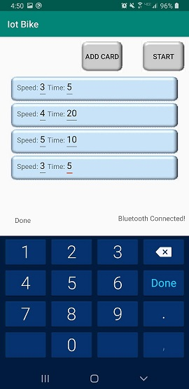

# Iot-Bike

**What does it do?**
A system for measuring performance and setting goals for bike riding. Available as an android app. App has three modes:
* Goal Setting: Determine how fast you want to go and for how long. LED turns blue if you're going too slow,
red if you're going too fast, and green for just right

* Measuring: LED simply shows you how fast you are going on a similar scale as goal setting: blue for pretty
slow, red for pretty fast, green for in between

* Rainbow: for when you just want cool looking lights while you ride! Can also test bluetooth connection.
All data is also stored in Firebase and accessable through the graph mode.

**How does it work**
The information in this setup largely flows from the user’s phone to an arduino via bluetooth which finally
lights up LEDs. The phone transmits takes the user's input and the built in accelerometer to determine what 
color the LEDs should be. That data is transmitted to an HC-06 bluetooth module, which is directly wired into the
Arduino Uno as shown. The Arduino is powered by a battery pack and itself powers and controls the lights directly.
Throughout this process, data about the speed at various points in time is stored. This data is sent to the cloud
through firebase when the app is closed, to be retrieved in graph mode.

For a demo, click [here](https://youtu.be/dh8N1zEurHc)

**Project Goals, Skills, and Tools**
* In order to fulfil the class requirements, I needed to make a project that uses different levels of 
IoT technology, from hardware to networking to the cloud
* Additionally, I wanted to make a project I would find personally useful. As a frequent bike rider,
I thought it would be cool to add lights that were both fun and functional
* I worked on a variety of skills to complete this project:
	* Researching hardware. Though I've worked with Arduino before, my past experience was mostly kits
and tutorials. For this project I had to research the best way to accelerometer data, use bluetooth, and 
connect LEDs
	* Creating a physical system from scratch. Though I've planned a lot of programming projects from
the ground up, this was my first experience with such a physical project. In addition to researching the
hardware, I had to figure out how to power each component and how the user would interact with it.
* I also worked with several new programs and hardware
	* I've never worked with bluetooth before. For this project, I learned how to implement it into
both a mobile app and an Arduino project using the HC-06 module.
	* Adafruit NeoPixels. I've seen them before but never personally worked with them

**Reflection**
I feel like I got a lot out of this project. I really enjoyed going out of my usual zone of software
and working with all the electrical components. I learned a lot about what is needed for those kinds
of projects and how to approach them. Of course, no project is perfect. Some improvements that could
be made include:
* Finding a better way to measure speed. The current kinematic equation is not very sophisticated
* Improving the GUI. Its not very pretty, and really inconsistent
* Improving graphing capabilities. Currently, the user can only see one day at a time. Ideally,
they could track progress over time
